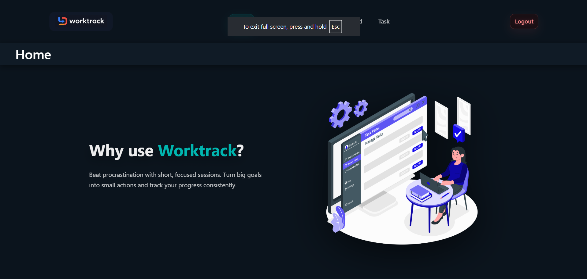
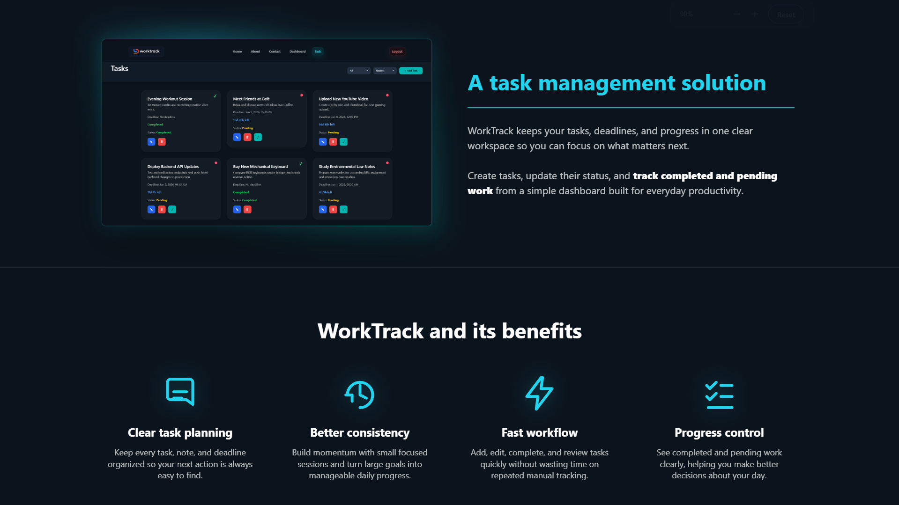
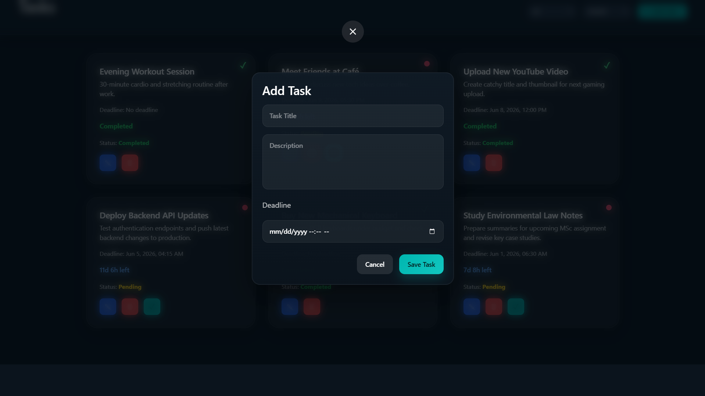
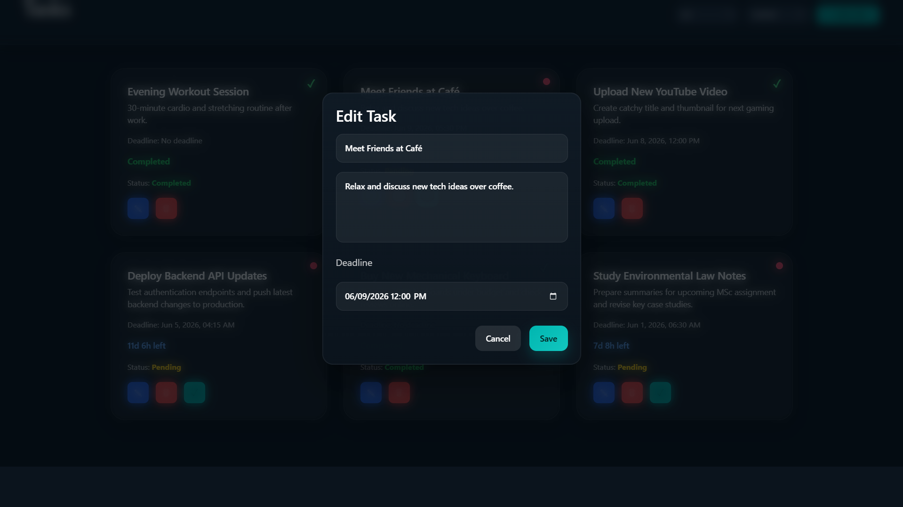
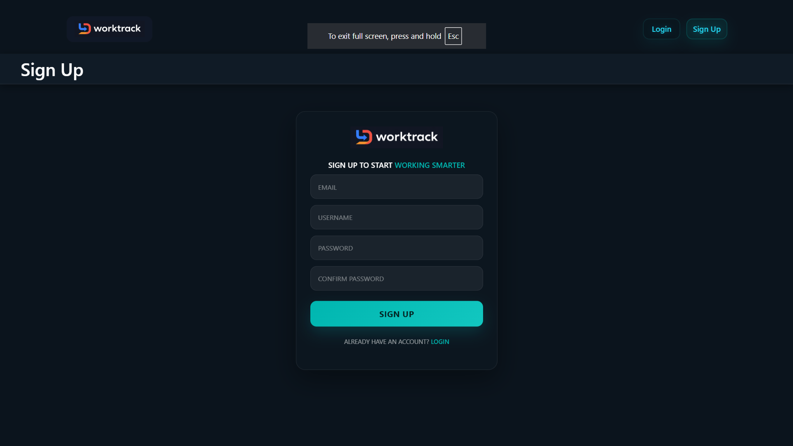

# � WorkTrack


---

# 📌 Overview

A modern full-stack task management web application built using **React**, **TypeScript**, **Node.js**, and **Express.js**.  
The application helps users organize daily workflows, manage priorities, track deadlines, and improve productivity with a clean and responsive interface.

---

# 🌐 Live Demo

🚀 **[View Live Application](https://task-maneger-three.vercel.app)**

[](https://youtu.be/dZYch9NAEYk))

---

# ✨ Features

## 📋 Task Management
- Create tasks with titles, descriptions, and due dates
- Edit existing tasks
- Delete completed or unnecessary tasks
- View detailed task information

## 🚦 Priority System
- High Priority
- Medium Priority
- Low Priority

## 🔐 Authentication
- Secure JWT-based authentication
- User signup and login system
- Protected routes and session handling

## 🎨 Responsive User Interface
- Modern dashboard layout
- Mobile-friendly responsive design
- Smooth navigation experience
- Reusable React components

## ⚡ Backend API
- RESTful API architecture
- Full CRUD functionality
- SQL database integration
- Secure data handling

---

# 🛠️ Tech Stack

## Frontend
| Technology | Purpose |
|---|---|
| React | UI Development |
| TypeScript | Type Safety |
| Vite | Build Tool |
| CSS | Styling |

## Backend
| Technology | Purpose |
|---|---|
| Node.js | Runtime Environment |
| Express.js | Backend Framework |
| SQL (MySQL/SQLite) | Database |
| JWT | Authentication |

---

# 🏗️ System Architecture

```text
┌──────────────────┐
│  React Frontend  │
│  (TypeScript)    │
└────────┬─────────┘
         │ HTTP/REST API
         ▼
┌──────────────────┐
│  Express Backend │
│   (Node.js)      │
└────────┬─────────┘
         │ SQL Queries
         ▼
┌──────────────────┐
│   SQL Database   │
│ (MySQL/SQLite)   │
└──────────────────┘
```

---

# 📸 Screenshots

## 🖥️ Dashboard



## ➕ Create Task


## ✏️ Edit Task


## 🔐 Authentication


---

# 🚀 Getting Started

## 📋 Prerequisites

Make sure your system has:

- Node.js (v16 or later)
- npm or yarn
- Git
- SQL Database (MySQL or SQLite)

---

# 💻 Installation

## 1️⃣ Clone Repository

```bash
git clone https://github.com/your-username/task-manager.git
cd task-manager
```

---

## 2️⃣ Install Frontend Dependencies

```bash
npm install
```

---

## 3️⃣ Install Backend Dependencies

```bash
cd backend
npm install
cd ..
```

---

## 4️⃣ Configure Environment Variables

### Frontend `.env`

```env
VITE_API_URL=http://localhost:5000
```

### Backend `.env`

```env
PORT=5000
DB_HOST=localhost
DB_USER=root
DB_PASSWORD=your_password
DB_NAME=task_manager
NODE_ENV=development
JWT_SECRET=your_secret_key
```

---

## 5️⃣ Start Frontend

```bash
npm run dev
```

---

## 6️⃣ Start Backend

```bash
cd backend
npm start
```

---

# 📁 Project Structure

```text
src/
├── components/
├── pages/
├── types/
├── assets/
└── services/

backend/
├── server.js
├── db.js
├── routes/
├── middleware/
├── controllers/
├── mailer.js
└── package.json
```

---

# 🔌 API Endpoints

## 📋 Task Routes

| Method | Endpoint | Description |
|---|---|---|
| GET | `/api/tasks` | Get all tasks |
| POST | `/api/tasks` | Create a task |
| GET | `/api/tasks/:id` | Get task details |
| PUT | `/api/tasks/:id` | Update task |
| DELETE | `/api/tasks/:id` | Delete task |

---

## 🔐 Authentication Routes

| Method | Endpoint | Description |
|---|---|---|
| POST | `/api/auth/signup` | Register user |
| POST | `/api/auth/login` | Login user |
| POST | `/api/auth/logout` | Logout user |

---

# 🔧 Available Scripts

| Command | Description |
|---|---|
| `npm run dev` | Start frontend |
| `npm run build` | Build application |
| `npm run preview` | Preview production build |
| `npm run lint` | Run ESLint |

---

# 🛠️ Troubleshooting

## Port Already In Use

```powershell
Get-Process -Id (Get-NetTCPConnection -LocalPort 5000 -ErrorAction Ignore).OwningProcess | Stop-Process
```

---

## Database Connection Issues

- Ensure MySQL/SQLite server is running
- Verify `.env` credentials
- Confirm database exists

---

## Frontend Cannot Connect to Backend

- Verify backend server is running
- Check `VITE_API_URL`
- Inspect browser console for CORS issues

---

## Dependency Errors

```bash
rm -r node_modules package-lock.json
npm install
```

---

# 🤝 Contributing

Contributions are welcome!

## Steps

1. Fork the repository
2. Create a feature branch

```bash
git checkout -b feature/your-feature
```

3. Commit changes

```bash
git commit -m "Add your feature"
```

4. Push changes

```bash
git push origin feature/your-feature
```

5. Open a Pull Request

---

# 🐞 Reporting Issues

When reporting bugs, please include:

- Problem description
- Steps to reproduce
- Expected behavior
- Screenshots if applicable

---

# 📜 License

This project is developed for educational and portfolio purposes.

---

# 👨‍💻 Author

**Vinuk Jithsara**

- Full-Stack Developer
- Passionate about modern web applications and clean UI design

---

Made with ❤️ using React, TypeScript, Node.js, and Express.js.
